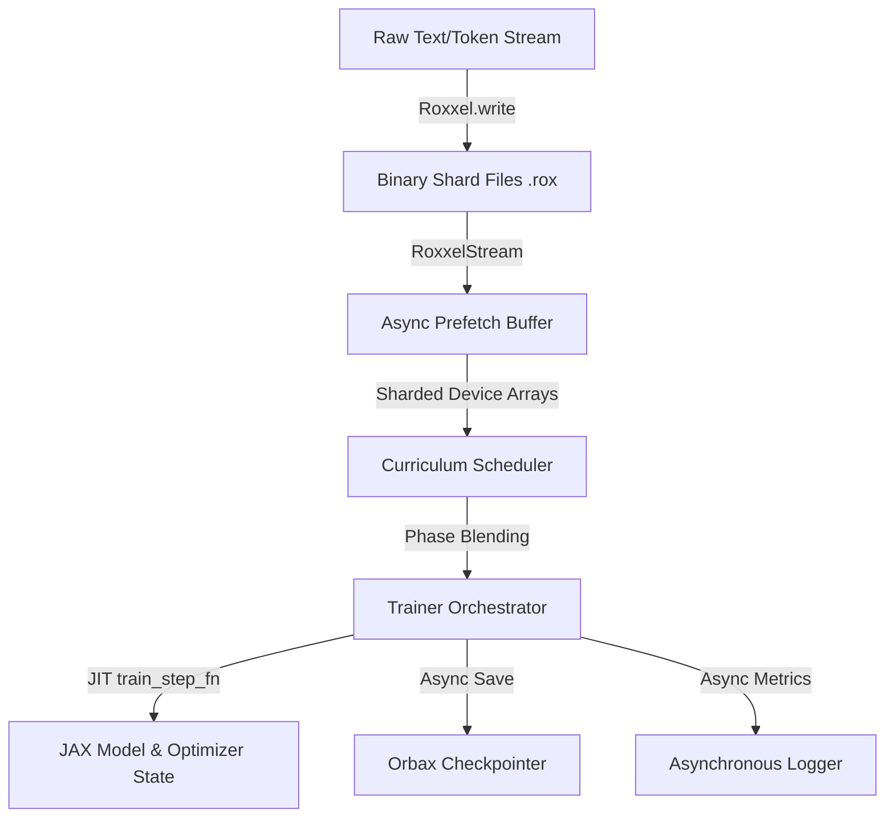

# Roxxel Development & Architectural Decisions Log

This document serves as a persistent repository log detailing the core architecture, key design decisions, and active development state of `roxxel`. 

---

## 1. Core Architecture Map
`roxxel` is designed as a high-performance, curriculum-aware token streaming and pre-training library for JAX/Flax NNX. It consists of the following components:



* **`Roxxel` & `RoxxelStream` ([core.py](file:///home/anon/Code/roxxel/roxxel/core.py)):** Memory-mapped binary shard manager utilizing zero-copy NumPy buffers to feed tokens with zero RAM overhead. Includes background thread prefetching.
* **`Curriculum` & `Phase` ([trainer.py](file:///home/anon/Code/roxxel/roxxel/trainer.py#L7-L49)):** Organizes multi-phase schedules (sequencing changes in batch size, sequence length, and blend weights). Resolves epoch counts into step counts automatically.
* **`Trainer` ([trainer.py](file:///home/anon/Code/roxxel/roxxel/trainer.py#L60)):** The runtime coordinator that JIT compiles the training loop step, handles sharding specifications, periodically triggers checkpoints/logging, and manages phase swapping boundaries.
* **`Checkpointer` ([checkpoint.py](file:///home/anon/Code/roxxel/roxxel/checkpoint.py)):** Asynchronous checkpoint saver utilizing Orbax Checkpoint Manager to serialize states without blocking accelerators.
* **`Logger` ([logging.py](file:///home/anon/Code/roxxel/roxxel/logging.py)):** Rank-zero safe, non-blocking asynchronous metrics logging to standard outputs and CSVs.

---

## 2. Key Architectural Decisions

### ⚡ Zero-Copy NumPy Shard Reading
* **Decision:** Replaced Python byte copy slicing inside `RoxxelStream` with direct pointer offsets using contiguous NumPy views.
* **Rationale:** Prevented high CPU usage bottlenecks during data loading that starved accelerators.

### 🔄 Sliding-Window JAX Queue Limit
* **Decision:** Configured a sliding-window queue (`async_queue_depth: int = 2`) that periodically blocks the host on step `i - async_queue_depth`'s loss.
* **Rationale:** Bounded the maximum asynchronous dispatch queue depth to prevent JAX from accumulating intermediate activation grids for dozens of un-executed steps on the device, avoiding memory exhaustion OOM errors.

### 📉 Trainer-Level Gradient Accumulation
* **Decision:** Implemented gradient accumulation inside the single JIT-compiled `train_step` rather than using `optax.MultiSteps`.
* **Rationale:** Keeps step counter tracking (`state.step`) and learning rate schedules natively aligned to the effective step counts instead of micro-batch step counts, and reduces host dispatch overhead.

---

## 3. How to Enable Memory Optimization Options

### 1. Enable Gradient Accumulation in Trainer
To train large models (e.g., 236M parameters) on systems with limited VRAM (e.g., 16 GB), pass `grad_accum_steps` to your `Trainer`:
```python
trainer = Trainer(
    model=model,
    optimizer=optimizer,
    curriculum=curriculum,
    loss_fn=loss_fn,
    grad_accum_steps=8,       # Accumulates gradients over 8 micro-batches
    async_queue_depth=2,      # Bounded double buffering queue
)
```
*Note: The trainer automatically adjusts accumulation steps (e.g., to `min(grad_accum_steps, batch_size)`) if a phase's batch size is smaller than the accumulation factor to avoid division issues.*

### 2. Enable Activation Checkpointing in Model (User-Level Action)
In your model definition (e.g., `Xenron`), wrap your transformer layer stacks in `nnx.remat` to free intermediate activations during the forward pass:
```python
from flax import nnx

class TransformerBlock(nnx.Module):
    # Your layer block definition...
    ...

class Xenron(nnx.Module):
    def __init__(self, num_layers: int, rngs: nnx.Rngs):
        # Wrap the blocks with rematerialization (checkpointing)
        self.layers = [
            nnx.remat(TransformerBlock)(rngs=rngs)
            for _ in range(num_layers)
        ]
```
This drops the activation footprint from $O(\text{Layers})$ to $O(1)$ and prevents out-of-memory errors on large context sequences (e.g., 2,048).
