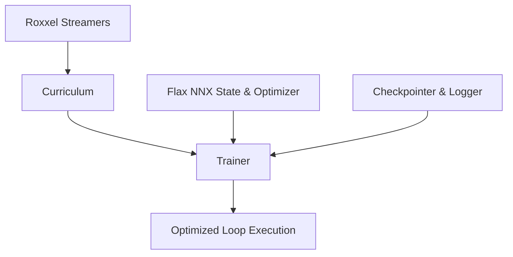

# End-to-End Tutorial: Multi-Phase Curriculum Learning

This tutorial shows how to construct an end-to-end distributed pre-training pipeline using **Roxxel**. We will showcase how to build a dynamic curriculum learning schedule (progressively shifting from short-context length to long-context length) and execute it using Roxxel's built-in `Trainer` and `Curriculum` system.

---

## 🌟 Architecture Overview

Roxxel's training runner infrastructure uses a modular, decoupled hierarchy to manage data streaming and execution:

1. **Streamer (`Roxxel`)**: The core class representing virtualized, memory-mapped shards of dataset blocks.
2. **`Curriculum`**: Manages the training roadmap (phases, sequence lengths, batch sizes, dataset weights, and dataset blending). It wraps the primary and optional secondary dataset streamers.
3. **`Trainer`**: The orchestrator class. It accepts the `Curriculum` schedule, JAX model/optimizer, JIT-compiled train step, async `Logger`, and `Checkpointer`. It runs the training loop, automatically hot-swapping streams and reshaping JAX arrays at step boundaries, saving checkpoints, and executing evaluations.



---

## Complete Curriculum Pre-Training Cookbook

Here is a complete, real-world implementation combining data compilation, multi-phase curriculum streaming, asynchronous logging, JAX hardware device sharding, and Orbax asynchronous checkpointing:

```python
import os
import jax
import jax.numpy as jnp
import optax
import numpy as np
from flax import nnx
from jax.sharding import Mesh, NamedSharding, PartitionSpec as P
from jax.experimental import mesh_utils

from roxxel import Roxxel, Logger, Phase, Curriculum, Trainer
from roxxel.checkpoint import Checkpointer

# --- 1. DEFINE ARCHITECTURE AND STATE ---
class Xenron(nnx.Module):
    """Xenron model architecture."""
    def __init__(self, num_layers: int, rngs: nnx.Rngs):
        self.embed = nnx.Embed(10000, 256, rngs=rngs)
        self.linear = nnx.Linear(256, 10000, rngs=rngs)
        
    def __call__(self, x):
        return self.linear(self.embed(x))

class XenronState(nnx.Module):
    """Unified module wrapping model state, optimizer, and training step count."""
    def __init__(self, model: Xenron, optimizer: nnx.Optimizer):
        self.model = model
        self.optimizer = optimizer
        self.step = nnx.Variable(jnp.array(0, dtype=jnp.int32))

# --- 2. COMPILE TOY DATASET ---
def token_generator():
    """Generates continuous tokenized integer sequences."""
    for i in range(10000):
        yield np.random.randint(0, 10000, size=(128,), dtype=np.int32)

DATASET_PATTERN = "./wiki_*.rox"
rox = Roxxel(DATASET_PATTERN)
# Compile raw token generator into uniform 4KB block archives
rox.write(token_generator(), separator=b"\x00", block_size=4096, max_shard_bytes=1024**3)

# --- 3. TRAINING HYPERPARAMETERS ---
GLOBAL_SEED = 42
LR = 3e-4
checkpoint_path = "./checkpoints"

# --- 4. SAMPLING AND TRAINING FUNCTIONS ---
def sample_now(state: XenronState) -> str:
    """Mock sampling function for step evaluation."""
    return f"[Decoded Text from step {int(state.step.value)}]: Once upon a time in a JAX device cluster..."

# Define JIT-compiled train step
@nnx.jit
def train_step(state: XenronState, batch: jax.Array) -> dict:
    def loss_fn(model):
        # Predict next tokens (causal shift)
        logits = model(batch[:, :-1])
        targets = batch[:, 1:]
        loss = optax.softmax_cross_entropy_with_integer_labels(logits, targets).mean()
        return loss
    
    loss, grads = nnx.value_and_grad(loss_fn)(state.model)
    state.optimizer.update(grads)
    state.step.value += 1
    
    return {"loss": loss, "ppl": jnp.exp(loss)}

# --- 5. MAIN TRAINING EXECUTION ---
def main():
    with Logger(log_dir="run_delta") as logger:
        logger.log_message("🚀 Initializing Distributed Pre-training Cluster...")

        # Initialize model
        rngs = nnx.Rngs(GLOBAL_SEED)
        model = Xenron(4, rngs)

        # Distributed hardware sharding paths
        devices = jax.devices()
        mesh = Mesh(mesh_utils.create_device_mesh((len(devices),)), axis_names=('data',))
        data_sharding = NamedSharding(mesh, P('data', None))

        # 1. Setup our Roxxel dataset streamers
        with Roxxel(filepath=DATASET_PATTERN) as init_ds:
            phase1_steps = init_ds.estimate_steps(seq_len=1025, batch_size=16)
            phase2_full_steps = init_ds.estimate_steps(seq_len=32769, batch_size=1)
            phase2_steps = int(phase2_full_steps * 0.20) # 20% of long-context epoch

        # 2. Define the curriculum schedule
        # Format: Phase(steps, batch_size, seq_len, optional_weights)
        phases = [
            Phase(steps=phase1_steps, batch_size=16, seq_len=1025), # Phase 1: Base Pre-training
            Phase(steps=phase2_steps, batch_size=1, seq_len=32769),  # Phase 2: Context Extension
        ]
        
        # Instantiate primary dataset curriculum
        curriculum = Curriculum(
            primary_streamer=Roxxel(DATASET_PATTERN),
            phases=phases
        )

        # 3. Calculate total optimizer tracking steps
        total_train_steps = sum(p.steps for p in phases)

        # Continuous decay schedule spanning the full curriculum duration
        tx = optax.chain(
            optax.clip_by_global_norm(1.0),
            optax.nadamw(
                learning_rate=optax.warmup_cosine_decay_schedule(
                    init_value=1e-7,
                    peak_value=LR,
                    warmup_steps=int(total_train_steps * 0.05),
                    decay_steps=total_train_steps,
                    end_value=LR * 0.01
                ),
                weight_decay=0.01
            )
        )

        optimizer = nnx.Optimizer(model, tx, wrt=nnx.Param)
        state = XenronState(model, optimizer)

        # 4. Instantiate async Orbax checkpointer
        handler = Checkpointer(checkpoint_path, state, optimizer)

        # 5. Define Trainer orchestrator
        trainer = Trainer(
            state=state,
            optimizer=optimizer,
            curriculum=curriculum,
            train_step_fn=train_step,
            checkpointer=handler,
            logger=logger,
            eval_fn=sample_now,
            eval_every=500,
            checkpoint_every=100,
            log_every=100,
            seed=GLOBAL_SEED,
            mesh=mesh,
            data_sharding=data_sharding
        )

        # 6. Execute training
        trainer.run()

if __name__ == "__main__":
    main()
```
